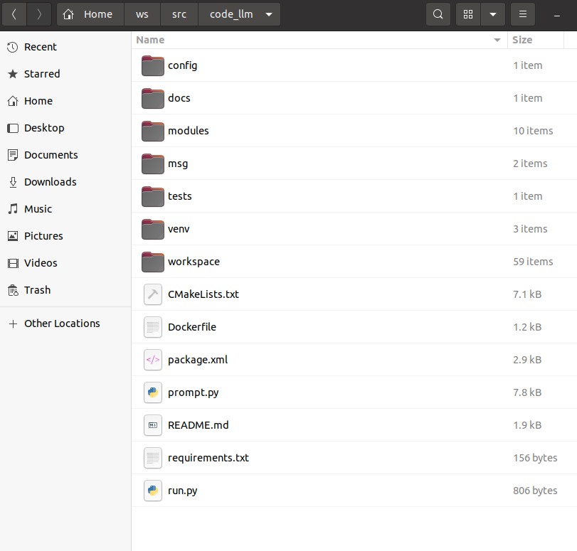

# 仿真环境使用手册

------

Version: 1.0

Data: 2024/3/5

Editors: MiangChen

------

## 1. 建立工作空间

- 创建工作空间 并 建立包
- 包的名字必须为 ***code_llm***

```cd
mkdir -p 自定义空间名称/src
cd 自定义空间名称
catkin_make

cd src
catkin_create_pkg code_llm rospy std_msgs geometry_msgs message_generation  

cd code_llm
```

## 2. 加入包文件

- 把Github上的 CodeLLM中全部文件复制到code_llm包中, 粘贴完如下图所示:



## 3. 编译工作空间

- 进入自定义工作空间目录, 编译

```
cd 工作空间
# 需要安装python3-em
sudo apt install python3-em

catkin_make -DPYTHON_EXECUTABLE=/usr/bin/python3   # 需要根据实际的python解释器位置更改路径
```

## 4.运行仿真环境

- 编辑环境变量, 注意根据实际情况调整***工作空间***和***ros***的绝对路径

```
gedit ~/.bashrc
加入以下内容: 
export PYTHONPATH=/home/{替换你的用户名}/{替换工作空间名}/devel/lib/python3/dist-packages:$PYTHONPATH
export PYTHONPATH=/opt/ros/noetic/lib/python3/dist-packages:$PYTHONPATH  # 根据实际的ubuntu版本进行调整
```

- 打开一个新的Terminal

```
cd 工作空间/src/code_llm/modules/env
conda activate pyxxx   # 选择使用哪个python来运行, 这里展示了conda的情况. py要3.10即可
python environment.py
```

## 5.配置pycharm中的路径

- 同样地, 手动给python interpreter添加***code_llm***和***ros***包的路径, 如图中倒数两行(added by user)所示: 


------

