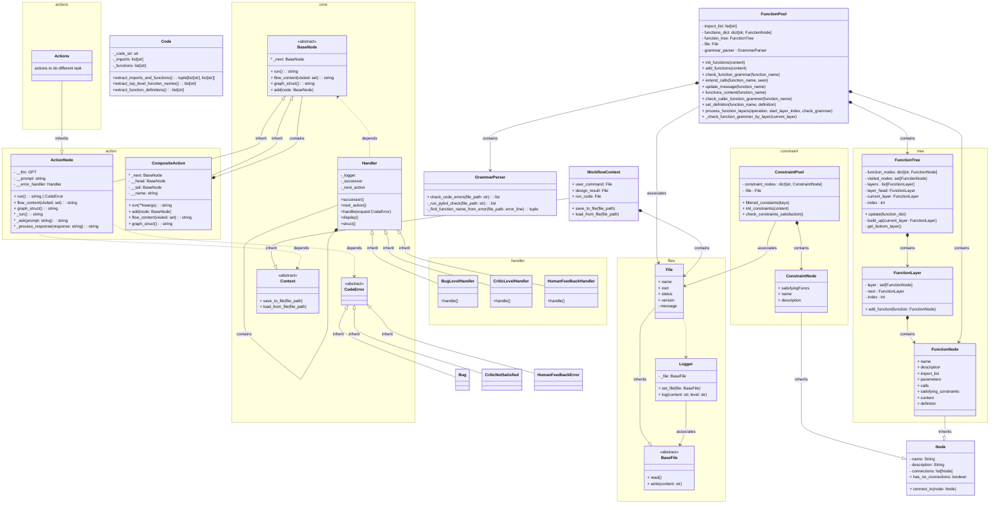

```mermaid
classDiagram
    namespace core {
        class BaseNode {
            <<abstract>>
            * _next: BaseNode
            + run(): string
            + flow_content(visited: set): string
            + graph_struct(): string
            + add(node: BaseNode)
        }

        class BaseNode {
            <<interface>>
        }

        class CodeError {
            <<abstract>>
        }


        class Handler {
            -_logger
            -_successor
            -_next_action
            +successor()
            +next_action()
            +handle(request:CodeError)
            +display()
            +struct()
        }

        class Context {
            <<abstract>>
            + save_to_file(flie_path)
            + load_from_file(file_path)
        }

    }

    class Node {
        - name: String
        - description: String
        - connections: list[Node]
        + connect_to(node: Node)
        + has_no_connections: boolean
    }

    namespace action{
        class ActionNode {
            - __llm: GPT
            - __prompt: string
            - __error_handler: Handler
            + run(): string | CodeError
            + flow_content(visited: set): string
            + graph_struct(): string
            * _run(): string
            * _ask(prompt: string): string
            * _process_response(response: string): string
        }
        class CompositeAction {
            * _next: BaseNode
            - __head: BaseNode
            - __tail: BaseNode
            - __name: string
            + run(**kwargs): string
            + add(node: BaseNode)
            + flow_content(visited: set): string
            + graph_struct(): string
        }
    }

    BaseNode <|-- ActionNode : inherit
    BaseNode <|-- CompositeAction : inherit
    BaseNode --* CompositeAction : contains

    namespace handler {
        class BugLevelHandler {
            +handle()
        }

        class CriticLevelHandler {
            +handle()
        }

        class HumanFeedbackHandler {
            +handle()
        }
    }

    CodeError <|-- Bug : inherit
    CodeError <|-- CriticNotSatisfied : inherit
    CodeError <|-- HumanFeedbackError : inherit
    BaseNode <.. Handler : depends
    Handler --* Handler : contains
    Handler <|-- BugLevelHandler : inherit
    Handler <|-- CriticLevelHandler : inherit
    Handler <|-- HumanFeedbackHandler : inherit


    class WorkflowContext {
        + user_command: File
        + design_result: File
        + run_code: File

        + save_to_file(flie_path)
        + load_from_file(file_path)
    }

    WorkflowContext --|> Context : inherit

    namespace files {
    class File {
        + name
        + root
        + status
        + version
        - message
    }

    class Logger {
        - _file: BaseFile
        + set_file(file: BaseFile)
        + log(content: str, level: str)
    }

    class BaseFile {
        <<abstract>>
        + read()
        + write(content: str)
    }

    }

    File --|> BaseFile  : inherits
    Logger --> BaseFile : associates
    File ..> Logger

    namespace constraint {


    class ConstraintNode {
        + satisfyingFuncs
        + name
        + description
    }
    class ConstraintPool {
        - constraint_nodes : dict[str, ConstraintNode]
        - -file : File
        + filtered_constaints(keys)
        + init_constraints(content)
        + check_constraints_satisfaction()
    }
    }


    ConstraintNode --|> Node  : inherits
    FunctionNode --|> Node : inherits

    namespace tree {
    class FunctionLayer {
        - layer : set[FunctionNode]
        - next : FunctionLayer
        - index : int
        + add_function(function: FunctionNode)
    }

    class FunctionTree {
        - function_nodes: dict[str, FunctionNode]
        - visited_nodes: set[FunctionNode]
        - layers : list[FunctionLayer]
        - layer_head: FunctionLayer
        - current_layer: FunctionLayer
        - index : int
        + update(function_dict)
        - build_up(current_layer: FunctionLayer)
        - get_bottom_layer()
    }

    class FunctionNode {
        + name
        + description
        + import_list
        + parameters
        + calls
        + satisfying_constraints
        + content
        + definiton
    }

    }

    FunctionTree *--> FunctionLayer : contains
    FunctionLayer *--> FunctionNode : contains


    class FunctionPool {
        - import_list: list[str]
        - functions_dict: dict[str, FunctionNode]
        - function_tree: FunctionTree
        - file: File
        - grammar_parser : GrammarParser

        + init_functions(content)
        + add_functions(content)
        + check_function_grammar(function_name)
        + extend_calls(function_name, seen)
        + update_message(function_name)
        + functions_content(function_name)
        + check_caller_function_grammer(function_name)
        + set_definiton(function_name, definition)
        + process_function_layers(operation, start_layer_index, check_grammer)
        + _check_function_grammer_by_layer(current_layer)

    }

    FunctionPool --> File : associates
    ConstraintPool --> File : associates

    WorkflowContext *--> File : contains
    ConstraintPool *--> ConstraintNode : contains
    FunctionPool *--> FunctionNode : contains
    FunctionPool *--> FunctionTree : contains
    FunctionPool *--> GrammarParser : contains
    ActionNode ..> Context : depends

    class GrammarParser {
        + check_code_errors(file_path: str): list
        -_run_pylint_check(file_path: str): list
        -_find_function_name_from_error(file_path, error_line): tuple
    }

    ActionNode ..> CodeError : depends

    Actions --|> ActionNode  : inherits

    namespace actions{
        class Actions {

        }
    }
    Actions: actions to do different task

    class Code {
        -_code_str: str
        -_imports: list[str]
        -_functions: list[str]
        +extract_imports_and_functions(): tuple[list[str], list[str]]
        +extract_top_level_function_names(): list[str]
        +extract_function_definitions(): list[str]
    }


```
