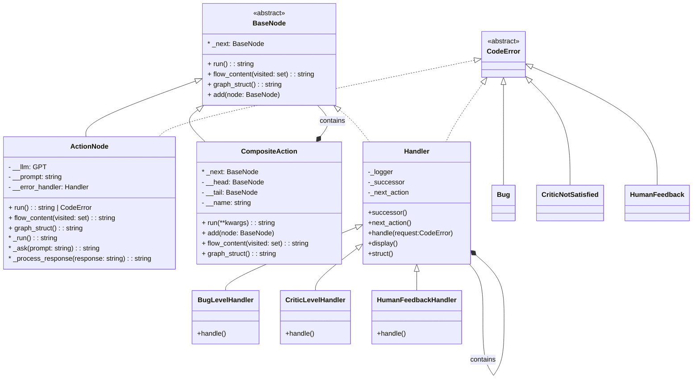

```mermaid
classDiagram
    class BaseNode {
        <<abstract>>
        * _next: BaseNode
        + run(): string
        + flow_content(visited: set): string
        + graph_struct(): string
        + add(node: BaseNode)
    }
    class ActionNode {
        - __llm: GPT
        - __prompt: string
        - __error_handler: Handler
        + run(): string | CodeError
        + flow_content(visited: set): string
        + graph_struct(): string
        * _run(): string
        * _ask(prompt: string): string
        * _process_response(response: string): string
    }
    class CompositeAction {
        * _next: BaseNode
        - __head: BaseNode
        - __tail: BaseNode
        - __name: string
        + run(**kwargs): string
        + add(node: BaseNode)
        + flow_content(visited: set): string
        + graph_struct(): string
    }

    BaseNode <|-- ActionNode
    BaseNode <|-- CompositeAction
    BaseNode --* CompositeAction : contains
    CodeError <|.. ActionNode

    
     class BaseNode {
        <<interface>>
    }

    class CodeError {
        <<abstract>>
    }

    class Handler {
        -_logger
        -_successor
        -_next_action
        +successor()
        +next_action()
        +handle(request:CodeError)
        +display()
        +struct()
    }

    class BugLevelHandler {
        +handle()
    }

    class CriticLevelHandler {
        +handle()
    }

    class HumanFeedbackHandler {
        +handle()
    }

    CodeError <|-- Bug
    CodeError <|-- CriticNotSatisfied
    CodeError <|-- HumanFeedback
    BaseNode <|.. Handler
    Handler --* Handler : contains
    Handler <|-- BugLevelHandler
    Handler <|-- CriticLevelHandler
    Handler <|-- HumanFeedbackHandler
    CodeError <|.. Handler
```