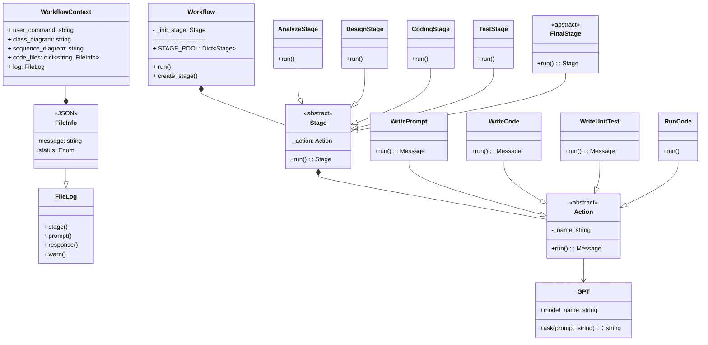

```mermaid
classDiagram
    class Workflow {
        - _init_stage: Stage
        --------------------------
        + STAGE_POOL: Dict~Stage~
        
        + run()
        + create_stage()
    }
    
    class FinalStage {
        <<abstract>>
        +run(): Stage
    }


    class FileInfo {
        <<JSON>>
        message: string
        status: Enum
    }
    
    class FileLog {
        + stage()
        + prompt()
        + response()
        + warn()
    }
    
    FileInfo --|> FileLog
    
    class WorkflowContext {
        + user_command: string
        + class_diagram: string
        + sequence_diagram: string
        + code_files: dict~string, FileInfo~
        + log: FileLog
    }

	class GPT {
        +model_name: string
		+ask(prompt: string)：string
	}

    class Stage {
    <<abstract>>
        -_action: Action
        +run(): Stage
    }

    class AnalyzeStage {
        +run()
    }

    class DesignStage {
        +run()
    }

    class CodingStage {
        +run()
    }

    class TestStage {
        +run()
    }


    class Action {
        <<abstract>>
        -_name: string
        +run(): Message
    }

    class WritePrompt {
        +run(): Message
    }

    class WriteCode {
        +run(): Message
    }

    class WriteUnitTest {
        +run(): Message
    }

    class RunCode {
        +run()
    }

    Action --> GPT
    Workflow *-- Stage
    AnalyzeStage --|> Stage
    DesignStage --|> Stage
    CodingStage --|> Stage
    TestStage --|> Stage
    FinalStage --|> Stage
    Stage *-- Action
    WritePrompt --|> Action
    WriteCode --|> Action
    WriteUnitTest --|> Action
    RunCode --|> Action

    WorkflowContext --* FileInfo
```