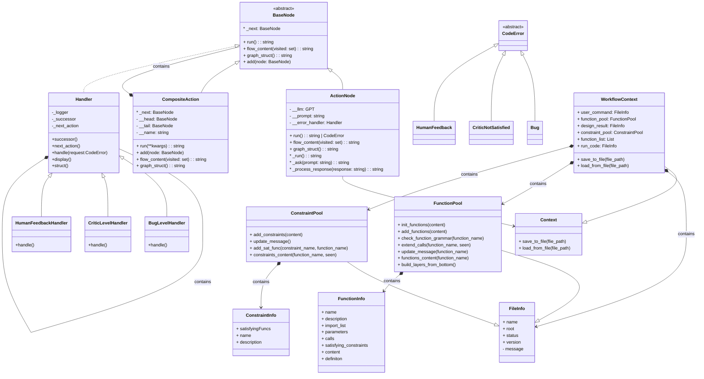

```mermaid
classDiagram
    class BaseNode {
        <<abstract>>
        * _next: BaseNode
        + run(): string
        + flow_content(visited: set): string
        + graph_struct(): string
        + add(node: BaseNode)
    }
    class ActionNode {
        - __llm: GPT
        - __prompt: string
        - __error_handler: Handler
        + run(): string | CodeError
        + flow_content(visited: set): string
        + graph_struct(): string
        * _run(): string
        * _ask(prompt: string): string
        * _process_response(response: string): string
    }
    class CompositeAction {
        * _next: BaseNode
        - __head: BaseNode
        - __tail: BaseNode
        - __name: string
        + run(**kwargs): string
        + add(node: BaseNode)
        + flow_content(visited: set): string
        + graph_struct(): string
    }

    BaseNode <|-- ActionNode
    BaseNode <|-- CompositeAction
    BaseNode --* CompositeAction : contains

    
     class BaseNode {
        <<interface>>
    }

    class CodeError {
        <<abstract>>
    }

    class Handler {
        -_logger
        -_successor
        -_next_action
        +successor()
        +next_action()
        +handle(request:CodeError)
        +display()
        +struct()
    }

    class BugLevelHandler {
        +handle()
    }

    class CriticLevelHandler {
        +handle()
    }

    class HumanFeedbackHandler {
        +handle()
    }

    CodeError <|-- Bug
    CodeError <|-- CriticNotSatisfied
    CodeError <|-- HumanFeedback
    BaseNode <|.. Handler
    Handler --* Handler : contains
    Handler <|-- BugLevelHandler
    Handler <|-- CriticLevelHandler
    Handler <|-- HumanFeedbackHandler
    
    
    class Context {
    	+ save_to_file(flie_path)
    	+ load_from_file(file_path)
    }
    
    
    class WorkflowContext {
    	+ user_command: FileInfo
    	+ function_pool: FunctionPool
    	+ design_result: FileInfo
    	+ constraint_pool: ConstraintPool
    	+ function_list: List
    	+ run_code: FileInfo
    	
    	+ save_to_file(flie_path)
    	+ load_from_file(file_path)
    }
    
    WorkflowContext --|> Context
    
    class FileInfo {
    	+ name
    	+ root
    	+ status
    	+ version
    	- message
    }
    
    class FunctionInfo {
    	+ name
    	+ description
    	+ import_list
    	+ parameters
    	+ calls
    	+ satisfying_constraints
    	+ content
    	+ definiton
    }
    
    class ConstraintInfo {
    	+ satisfyingFuncs
    	+ name
    	+ description
    }
    
    class FunctionPool {
    	+ init_functions(content)
    	+ add_functions(content)
    	+ check_function_grammar(function_name)
    	+ extend_calls(function_name, seen)
    	+ update_message(function_name)
    	+ functions_content(function_name)
    	+ build_layers_from_bottom()
    }
    
    FunctionPool --|> FileInfo
    
    class ConstraintPool {
    	+ add_constraints(content)
    	+ update_message()
    	+ add_sat_func(constraint_name, function_name)
    	+ constraints_content(function_name, seen)
    }
    
    ConstraintPool --|> FileInfo
    
    
 	WorkflowContext *--> FileInfo : contains
 	WorkflowContext *--> FunctionPool : contains
 	WorkflowContext *--> ConstraintPool : contains
 	ConstraintPool *--> ConstraintInfo : contains
 	FunctionPool *--> FunctionInfo : contains
 	ActionNode --> Context
 	 	
 	

```

renderer should be set in main