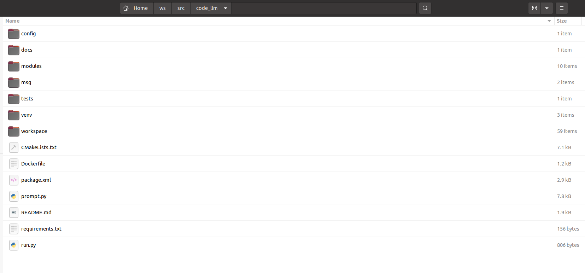
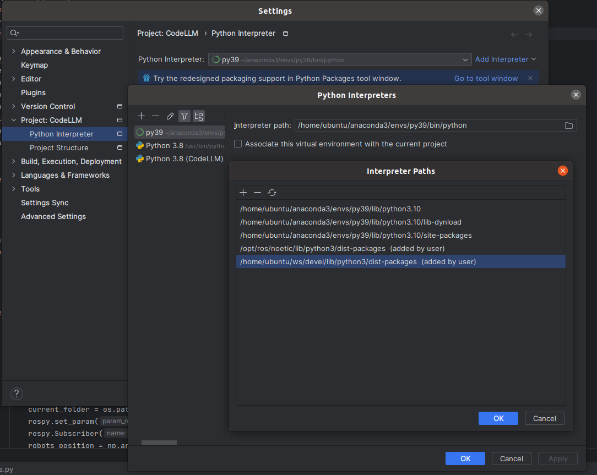

# Simulation Environment User Manual

## 1. Environment Setup

### 1.1 Create Workspace

- Create the workspace and package.
- The package must be named ***code_llm***.

```bash
mkdir -p custom_workspace_name/src
cd custom_workspace_name
catkin_make

cd src
catkin_create_pkg code_llm rospy std_msgs geometry_msgs message_generation

cd code_llm
```

### 1.2 Add Package Files

- Copy all the files from CodeLLM into the code_llm package. If `-b branch_name` is not used, the default master branch will be cloned.

```
git clone -b branch_name https://github.com/WestlakeIUSL/CodeLLM.git
```

- The final directory structure is shown below:



### 1.3 Build Workspace

- Go to the custom workspace directory, install `python3-empy`, and compile. When compiling, it's recommended to specify the Python interpreter. Adjust the path according to the local Python version. For Ubuntu 18, it's `/usr/bin/python`, and for Ubuntu 20, it's `/usr/bin/python3`. Avoid using Anaconda Python, as it may not access pip-installed packages.

```bash
cd workspace_directory
sudo apt install python3-empy
catkin_make -DPYTHON_EXECUTABLE=/usr/bin/python3
```

### 1.4 Create Virtual Environment

- Create and activate a virtual environment. Navigate to the code_llm directory and install the required packages.

```bash
conda create -n env_name python=3.10
conda activate env_name

pip install -r ./requirements.py
```

### 1.5 Configure Path

- Option 1: In VSCode, you can add the following configuration to your `settings.json`.

```json
{
  "python.autoComplete.extraPaths": [
    "/opt/ros/noetic/lib/python3/dist-packages",
    "/xxx/yyy_workspace/devel/lib/python3/dist-packages"
  ]
}
```

- Option 2: In PyCharm, manually add the ***code_llm*** and ***ros*** package paths to the Python interpreter, as shown in the last two lines (added by the user) in the image below:



## 2. Running the Environment

### 2.1 Normal Test Run

- Run `environment.py`. Execute the following command in the terminal:

```bash
cd workspace_directory/src/code_llm/modules/env
conda activate env_name
python environment.py
```

> Note: Ensure `environment.py` is run before proceeding.

- Run `code_llm/run.py` directly from the IDE.

### 2.2 Test an Existing Workspace

- Run `environment.py` in the terminal, and modify `code_llm/modules/stages/running_stage.py`. Change
  `set_workspace_root('/home/ubuntu/Desktop/CodeLLM/workspace/2024-03-05_20-03-52')` to the path of the workspace to test.
- Run `code_llm/modules/stages/running_stage.py` directly from the IDE.

## Logs

---

Version: 1.0

Date: 2024/3/5

Editors: MiangChen

The initial draft of the user manual, explaining how to set up a workspace, add package files, build the workspace, run the simulation environment, and configure paths in PyCharm.

---

Version: 1.1

Date: 2024/3/6

Editors: WenkangJi

Added usage instructions and further clarifications to the initial draft.

---

Version: 1.2

Date: 2024/10/12

Editors: Guobin Zhu

Added detailed usage instructions.

---
